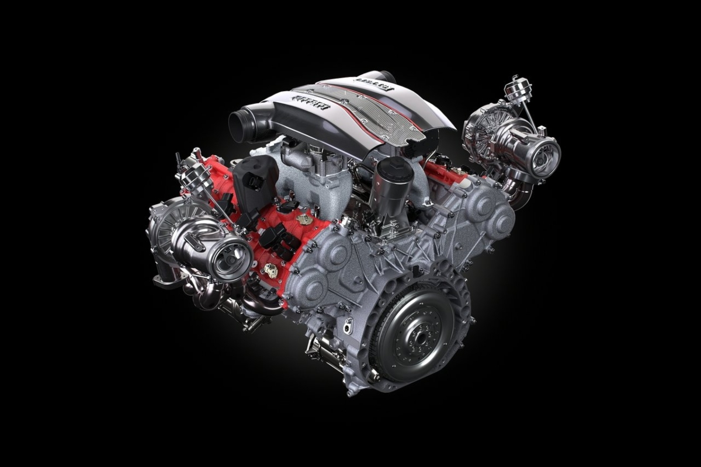

# Coches V10 

El motor V10 es un motor de combustión interna con diez cilindros dispuestos en dos filas de cinco cilindros.

*V8 a 60º*

*V8 A 90º*

Los motores V10 son usados principalmente en automóviles deportivos y camionetas de gran tamaño, pudiendo ser usados también en camiones pesados. También fueron usados en las carreras de Fórmula 1 desde el año 1989 hasta 2005, cuando el reglamento pasó a permitir solamente el uso de motores V8. Durante el período que fueron usados en la Fórmula 1 demostraron ser la configuración ideal, y en los últimos años en los que se permitió su uso fueron la opción elegida por prácticamente todas las escuderías.

Se distinguen:

V8 cross-plane: Frecuentemente usado en los automóviles. La primera y última biela están a 180º de distancia entre las demás como son la segunda o tercera.

V8 flat-plane: basado en el cigüeñal de los motores 4 cilindros de ángulos 180º. El ángulo de barcos puede ser de 90º y 180º. Se usan frecuentemente en monoplazas de competición.

## 1.1 Historia del V8

Aunque nos parezca mentira, los primeros V8 no fueron montados en autómoviles. Empezaron cerca del 1904 montándose en aeronaves y lanchas. Hubo que esperar casi 3 décadas (1932) para ver el primer coche V8 de la historia.

En 1932, Ford crea el Ford Coupé con un V8 de 65 caballos de potencia, otro coche revolucionario de Ford al igual que el Model T.
En 1955, Ford volvió a hacer el Ford Coupé pero esta vez más refinado todavía. Era el V8 más grande de la historia, con unos poderosos 145 caballos de potencia, que para la época eran bastantes.

Durante la época de los 50, debido a la reapertura de las fábricas después de la Segunda Guerra Mundial, en EEUU solo se hacían coches familiares con poca deportividad.

Pero fue la revolución juvenil de la época de los 60 la que abrió el camino a nuevos deportivos americanos llamados muscle cars.
Los jóvenes querían esos coches porque representan su ‘libertad’ y ‘estilo’, ya que era para ser diferente a sus padres. Lo malo, que a los jóvenes no se podían permitir esos coches por temas económicos. 

No fue hasta 1964 donde Pontiac presentó uno de los primeros ‘Muscle Cars’, el Pontiac GTO, y se empezaron a popularizar de una manera masiva. Tanto fue el impacto que varios fabricantes de coches americanos como Ford, Chevrolet, Dodge, Plymouth… No tardaron en responder al GTO y poco a poco se fueron popularizando bastante durante la época de los 60.

En la década de los 70 los Muscle Cars vivieron una época muy gris. En 1973, Dodge junto a Chrysler sacó lo que se conoce como uno de los últimos Muscle Car puros: El Dodge Charger 440 R/T Six-Pack, con unos muy buenos 390 caballos de potencia.

Pero a partir de ahí todo fue en declive. La crisis petrolífera afectó a todo el país y los motores V8 se fueron esfumando durante bastantes años, dando así la extinción de los ‘Muscle Cars’ en 1978.

A partir de ahí, las marcas estadounidenses empezaron a hacer coches compactos con motores pequeños pero eficientes.
Algunos de esos compactos son; Chevrolet Vega GT, Chevrolet Chevelle hatchback, Dodge Omni…

Al principio de los 80, los muscle cars regresaron, pero sin comparación a los antiguos. En cambio, estos eran más económicos, deportivos y cómodos. Los actuales siguen siendo económicos, pero se sigue perdiendo esos motores grandes debido a las contaminaciones de CO2.

## 1.2 Primeros coches V8
1. Ford Coupé (1932)
2. Ford Coupé (1955)
3. Ford Thunderbird (1957)
4. Chevrolet Corvette (1953-1962)
5. Chevrolet Bel Air II (1955-1957)
6. Mercury Coupe (1939-1951)

## 2. Coches emblemáticos
### 1. Ford Shelby GT500 (1967)

En 1965, Carroll Shelby decidió modificar el Ford Mustang, otorgándole una potencia de 306 caballos de potencia. 

En 1967, decidieron fabricar el Ford Mustang Shelby GT500. El Shelby GT500 era una versión más extrema del Shelby GT350 y, por supuesto, del Ford Mustang. 
Cuenta con un motor 7.0 litros V8 que tiene el Ford GT40, coche perfeccionado por Carroll Shelby y ganador de Le Mans.
    
<image src="https://noticias.coches.com/wp-content/uploads/2015/06/Ford-Shelby-Mustang-GT500-1967-01.jpg" alt="Descripción de la imagen">

### 2. Dodge Charger (1968)
Dodge rediseñó este coche en 1968 para diferenciarlo del Coronet, modificando la línea del techo y agregando focos traseros redondos.
Salió a la venta con un precio de 3.014 dólares (21.000 dólares actuales) y, si pagabas 466 dólares (3.300 dólares actuales) extra, tendrías el paquete R/T.
El paquete R/T trae un poderoso 7.2 litros V8 con 375 caballos de potencia, frenos mejorados y suspensión mejorada.             
                                

<image src="https://cdn.classic-trader.com/I/images/1920_1920_inset/vehicle_ad_standard_image_835a30895e3e495fa1e60825bc9d161e.jpg" alt="Descripción de la imagen">

### 3. Pontiac GTO (1964)
Para muchos, el Muscle Car original. Este coche fue la causa de conocer hoy en día los Ford Mustang, Chevrolet Camaro, Dodge Charger…
Nació porque Pontiac quería una versión mejorada y más rápida que el Tempest.
Con un motor 6.3 litros V8, el Pontiac GTO rompía muchos esquemas, ya que estos motores suelen llevarlos coches de dimensiones mayores.
La placa de identificación GTO se lanzó en 1964 como paquete opcional en el Tempest Le Mans, que ofrecía 329 caballos de potencia en la versión de un carburador y cuatro barriles o 348 caballos de potencia en la versión de carburadores de dos barriles.

<image src="https://cdn.dealeraccelerate.com/ag/1/523/42079/1920x1440/1964-pontiac-gto" alt="Descripción de la imagen">
